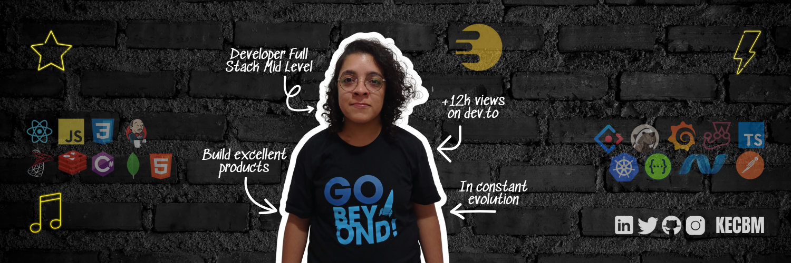
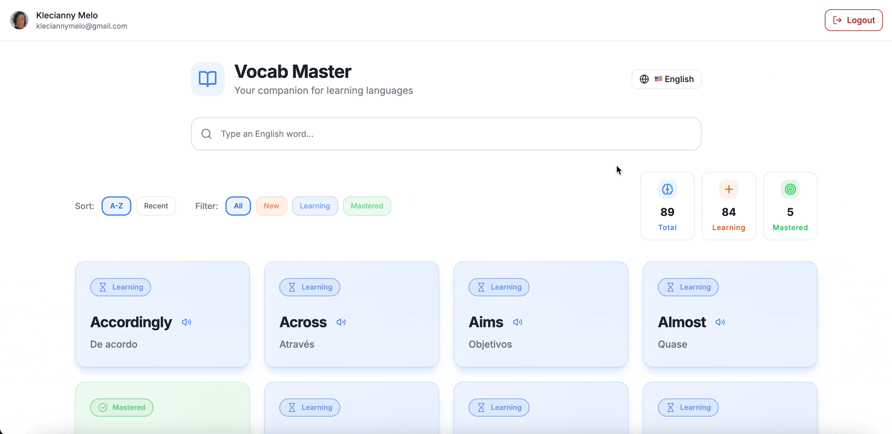
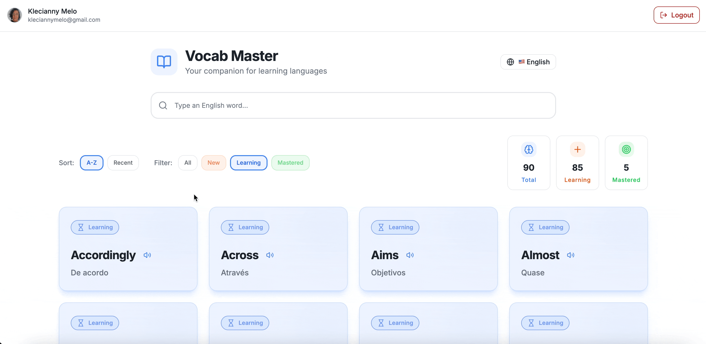
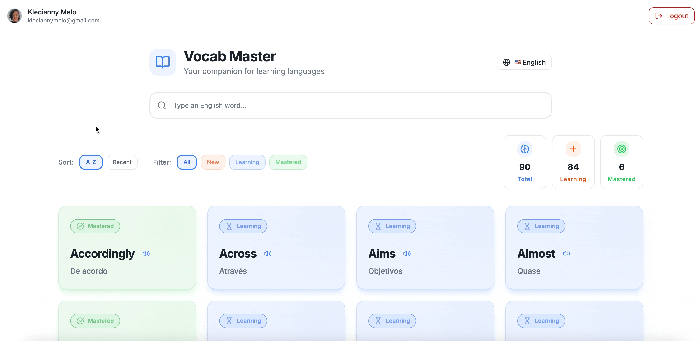

 
 

# 👋🏽 Hello, I'm Klecianny

As a Software Engineer AI First, I have 3 years of experience in software development with expertise in languages and frameworks such as:

- 🎨 Front end: HTML, CSS, JavaScript, Typescript, React
- ⚙️ Back end: Node.js, .NET, Python
- 💾 Database: Postgres, MongoDB, MySQL, SQL Server
- 🛠️ Ops: Jenkins, Docker, Git, Kubernetes

<!-- Use the Dev.to api for get status -->
As a content creator on DEV Community, I share insights on careers, problem-solving, and growth in technology, with over 24 published articles, 14,300 views, and 3,600 followers.

In my free time, I enjoy going to the gym to keep my mind and body active, riding my bike, reading books, and playing PlayStation 3.

Let’s connect and have a chat?

 
 

## 👩🏽‍🎓 Academic Training

I am a Food Engineer from UFAPE - Federal University of Agreste de Pernambuco. During my undergraduate studies, I had the opportunity to teach several subjects, the first of which was algorithms and computer programming, focusing on programming logic in C and Java. I recently specialized as a Full Stack Web Developer at Trybe.

  
<h3>🛠 Skills</h3>

<h4>Languages</h4>

  
 

<h4>Frontend Tools</h4>

         

 
  
<h4>Backend Tools</h4>

 

<h4>Testing Tools</h4>

 

<h4>DevOps Tools</h4>

 

<h4>Utility Tools</h4>

     

<h3>📊 Statistics</h3>

  

  
  

 
 

<!--
## 👩🏽‍💻 Professional

I am currently a Software Engineer AI First at 

 
 
-->

## 🌎 Side Project

### 📖 Vocab Master – Aprenda Vocabulário Sem Interromper Sua Leitura

Transforme sua leitura em uma experiência de aprendizado de idiomas poderosa.
Com o Vocab Master, você não perde o ritmo: capture, traduza e estude novas palavras em inglês ou francês enquanto lê livros, artigos ou qualquer conteúdo.

## ✨ Principais Diferenciais

- 🚀 Captura Instantânea → adicione palavras com um clique e obtenha tradução automática.
- 🧠 Aprendizado Inteligente → organize por status: New, Learning, Mastered.
- 📚 Foco no Contexto → relacione cada palavra ao livro ou artigo em que você a encontrou.
- 🎧 Pronúncia Autêntica → ouça como a palavra realmente soa com vozes nativas.
- 📊 Progresso Visível → estatísticas em tempo real sobre seu vocabulário e leitura.

## 🎬 Demonstrações em GIFs:

📚 Adicione novas palavras e veja a mágica acontecer

🎮 Transforme seu aprendizado em um jogo

🔎 Encontre qualquer palavra em segundos

“Não deixe palavras desconhecidas atrapalharem sua leitura.
Com o Vocab Master, cada página vira uma oportunidade de aprender.”

[👉 Acesse o projeto](mastervocab.vercel.app)

 
 

## 🗂️ Open Source Contributions

My contribution to open source project are:

- [`🌍 Awesome Made By Brazilians`](https://github.com/felipefialho/awesome-made-by-brazilians/pull/182): i added the css2wind project in the list of open source projects;
- [`🦕 Matheus Fidelis Personal Blog`](https://github.com/msfidelis/personal-blog): i reviewed articles about Kubernetes, AWS, Architecture, Terraform, Containers, System-Design and Cloud;
- [`🖼️ Markdown Badges`](https://github.com/Ileriayo/markdown-badges/pull/805): i added 10 new badges;

 

  
<h3>📑 Others Contributions</h3>

  - [`🎨 KawaiiLogos`](https://github.com/SAWARATSUKI/KawaiiLogos/pull/197): I add the português README translation;
  - [`🐧 Frontend Rinha`](https://github.com/codante-io/rinha-frontend/pull/28): i organized the list of JSON files in ascending order according to size and added this information to the list;
  - [`🆘 SOS Enchentes`](https://github.com/sidssouza/sos-enchentes/pull/1): i improved the pop-up design by adding a closed icon;

 
 

## 📖 Latest Blog Posts

<ul>
<li><a href="https://dev.to/kecbm/technical-and-business-refinement-why-tech-teams-cannot-ignore-it-43i5" target="_blank">🛠️ Technical and Business Refinement: Why Tech Teams Cannot Ignore It</a></li>
<li><a href="https://dev.to/kecbm/pessoas-desenvolvedoras-precisam-estudar-todos-os-dias-5dea" target="_blank">📚 Pessoas desenvolvedoras precisam estudar todos os dias</a></li>
<li><a href="https://dev.to/kecbm/a-importancia-da-comunicacao-para-uma-pessoa-desenvolvedora-4349" target="_blank">🗣️  A importância da Comunicação para uma pessoa desenvolvedora</a></li>
<li><a href="https://dev.to/kecbm/breaking-records-55ji" target="_blank">🏆 Breaking Records</a></li>
<li><a href="https://dev.to/kecbm/o-poder-das-tarefas-como-pequenas-entregas-levam-a-grandes-resultados-2of6" target="_blank">🧩 O Poder das Tarefas: Como Pequenas Entregas Levam a Grandes Resultados</a></li>
</ul>

 
 

----

## 🤠 Participations

<h3>🎥 In Interviews</h3>

- 💾 <a href="https://www.twitch.tv/videos/2435200518" target="_blank">Palestra De Volta ao Código no GitHub Brasil</a>
- 💻 <a href="https://www.linkedin.com/posts/kooperecooperativa_na-koopere-acreditamos-na-melhoria-cont%C3%ADnua-activity-7287448880298782721-nER5/?utm_source=share&utm_medium=member_desktop" target="_blank">Experiência de trabalho na Koopere</a>
- 💜 <a href="https://www.instagram.com/reel/C1UtOU5LvUY/?utm_source=ig_web_copy_link&igsh=MzRlODBiNWFlZA%3D%3D" target="_blank">Como a UX para Minas Pretas fez diferença na minha vida em 2023</a>
- 👩🏾‍💻 <a href="https://g1.globo.com/tecnologia/noticia/2023/05/10/ja-incentivo-meus-filhos-comeco-pode-ser-frustrante-profissionais-contam-como-e-trabalhar-com-programacao.ghtml" target="_blank">Profissionais contam como é trabalhar com programação - Globo</a>
- 🤖 <a href="https://www.youtube.com/watch?v=Tonfpy4eQFY&list=PLw0GGb7tHTHv3gdy39NrOrLh7TrnqjUrL" target="_blank">Série Muito além do código - XP Inc.</a>
  

 
 

## 🖥 Professional Performance

<!-- ⚖️ -->

🎓 Mid-Level Full Stack Developer - Eduzz (10/2024 - 05/2025)

⚡ Full Stack Developer - BR24 (05/2023 - 10/2024)

🏦 Software Engineer - XP Inc. (09/2022 - 03/2023)

<!-- 🎷 Saxophonist at the Manoel Rabelo Orchestra - Garanhuns City Hall (01/2017 - 12/2020) -->

 
 

## 🎓 Academic Education

💻 Full Stack Web Development - Trybe (10/2021 - 12/2022)

👩🏽‍🔬 Food Engineering - Federal University of Agreste de Pernambuco (01/2014 - 05/2021)

 
 

----

## 🤝🏾 Let's connect?

<!--  -->

 
 
 
 

  

