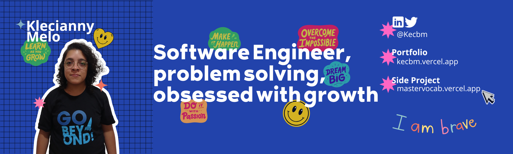

 
 

# 👋🏽 Hello, I'm Klecianny

Full Stack Software Engineer with 4 years of experience building web applications.

When I'm not coding, [I write about programming](https://dev.to/kecbm/).

 
 

<h3>🛠 Technologies</h3>

#### Languages

#### Frontend

#### Backend

#### DevOpss

#### IA

 
 

## 👩🏽‍💻 Professional

I am currently a Full Stack Software Engineer at Quorum

 
 

## 🌎 Side Project

### 📖 Vocab Master – Learn Vocabulary Without Interrupting Your Reading

Transform your reading into a powerful language learning experience.
With Vocab Master, you don't lose your rhythm: capture, translate, and study new words in English or French while reading books, articles, or any content.

[👉 Access the project](https://mastervocab.vercel.app/)

 
 

## 🗂️ Open Source Contributions

My contribution to open source project are:

- [`🌍 Awesome Made By Brazilians`](https://github.com/felipefialho/awesome-made-by-brazilians/pull/182): i added the css2wind project in the list of open source projects;
- [`🦕 Matheus Fidelis Personal Blog`](https://github.com/msfidelis/personal-blog): i reviewed articles about Kubernetes, AWS, Architecture, Terraform, Containers, System-Design and Cloud;
- [`🖼️ Markdown Badges`](https://github.com/Ileriayo/markdown-badges/pull/805): i added 10 new badges;

 

  
<h3>📑 Others Contributions</h3>

  - [`🎨 KawaiiLogos`](https://github.com/SAWARATSUKI/KawaiiLogos/pull/197): I add the português README translation;
  - [`🐧 Frontend Rinha`](https://github.com/codante-io/rinha-frontend/pull/28): i organized the list of JSON files in ascending order according to size and added this information to the list;
  - [`🆘 SOS Enchentes`](https://github.com/sidssouza/sos-enchentes/pull/1): i improved the pop-up design by adding a closed icon;

 
 

## 📖 Latest Blog Posts

<ul>
<li><a href="https://dev.to/kecbm/technical-and-business-refinement-why-tech-teams-cannot-ignore-it-43i5" target="_blank">🛠️ Technical and Business Refinement: Why Tech Teams Cannot Ignore It</a></li>
<li><a href="https://dev.to/kecbm/pessoas-desenvolvedoras-precisam-estudar-todos-os-dias-5dea" target="_blank">📚 Pessoas desenvolvedoras precisam estudar todos os dias</a></li>
<li><a href="https://dev.to/kecbm/a-importancia-da-comunicacao-para-uma-pessoa-desenvolvedora-4349" target="_blank">🗣️  A importância da Comunicação para uma pessoa desenvolvedora</a></li>
<li><a href="https://dev.to/kecbm/breaking-records-55ji" target="_blank">🏆 Breaking Records</a></li>
<li><a href="https://dev.to/kecbm/o-poder-das-tarefas-como-pequenas-entregas-levam-a-grandes-resultados-2of6" target="_blank">🧩 O Poder das Tarefas: Como Pequenas Entregas Levam a Grandes Resultados</a></li>
</ul>

 
 

----

## 🤠 Participations

<h3>🎥 In Interviews</h3>

- 💾 <a href="https://www.twitch.tv/videos/2435200518" target="_blank">Palestra De Volta ao Código no GitHub Brasil</a>
- 💻 <a href="https://www.linkedin.com/posts/kooperecooperativa_na-koopere-acreditamos-na-melhoria-cont%C3%ADnua-activity-7287448880298782721-nER5/?utm_source=share&utm_medium=member_desktop" target="_blank">Experiência de trabalho na Koopere</a>
- 👩🏾‍💻 <a href="https://g1.globo.com/tecnologia/noticia/2023/05/10/ja-incentivo-meus-filhos-comeco-pode-ser-frustrante-profissionais-contam-como-e-trabalhar-com-programacao.ghtml" target="_blank">Profissionais contam como é trabalhar com programação - Globo</a>
- 🤖 <a href="https://www.youtube.com/watch?v=Tonfpy4eQFY&list=PLw0GGb7tHTHv3gdy39NrOrLh7TrnqjUrL" target="_blank">Série Muito além do código - XP Inc.</a>
  

 
 

----

## 🤝🏾 Let's connect?

<!--  -->

 
 
 
 

  

